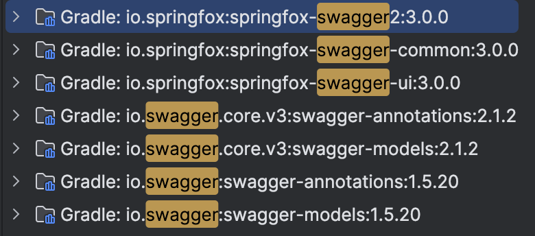
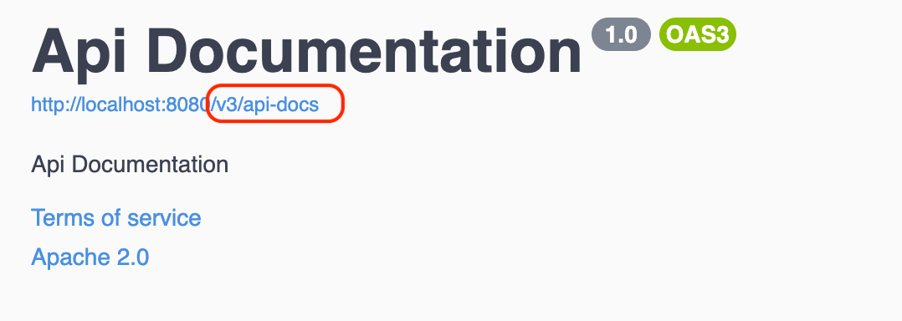
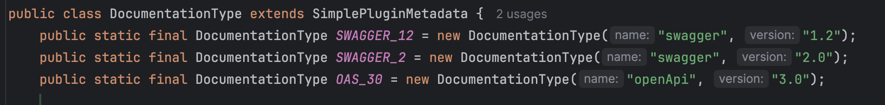
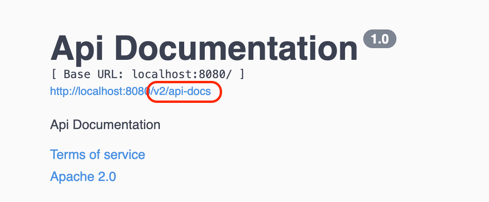
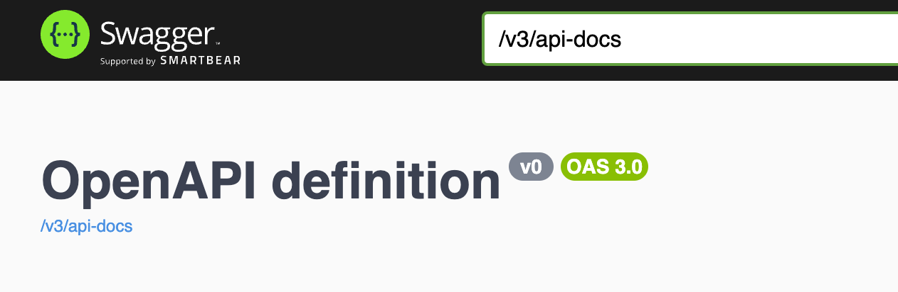
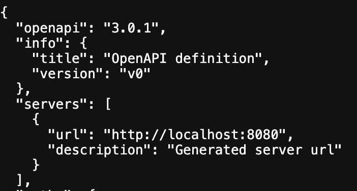
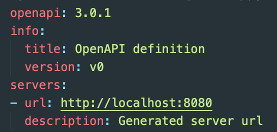

### **Spring에서의 API 문서화**
Spring에서는 `Swagger Specification`과 `OpenAPI Specification`을 구현한 라이브러리들을 이용하여 API 문서화를 할 수 있는데 대표적으로 `springfox`와 `springdoc`이 있다. 이번 포스트에서는 각 라이브러리에 대해 알아보자. 

<br>

### **Springfox**

#### **Springfox**
[Springfox](https://github.com/springfox/springfox)는 Spring을 이용하여 개발된 API에 대한 API 문서를 자동으로 생성해주는 라이브러리이다. 

Springfox의 버전에 따라 지원되는 Specification 버전이 다른데, springfox 2.x 버전 이하까지는 `Swagger Specification 2.0` 까지만 지원이 되고 springfox 3.x 이상 부터는 `OpenAPI Specification 3.0` 까지 지원이 된다.

또한 업데이트가 2020년 7월 이후 이뤄지지 않아서인지, Spring Boot 3 이상부터는 Springfox 라이브러리가 지원되지 않는다.

#### **Springfox 적용**

Springfox 사용을 위해서는 의존성 추가가 필요한데, 2.x 이하 버전에서는 `springfox-swagger2`와 `springfox-swagger-ui`를 각각 추가해주어야 하지만, 3.x 이상 부터는 `springfox-boot-starter` 하나만 추가를 해줘도 무방하다.

```groovy
implementation("io.springfox:springfox-boot-starter:3.0.0")
```

아래와 같이 `springfox-boot-starter` 하나만 추가해주어도 `springfox-swagger2`와 `springfox-swagger-ui` 같은 관련 라이브러리들을 알아서 끌고 온다.

{: width="400" height="300" .normal }

또한 springfox 3.x 버전부터는 Swagger 문서를 활성화시키는 `@EnableSwagger2`과 같은 애노테이션 추가가 불필요하고, swagger-ui 경로도 기존 `/swagger-ui.html`에서 `/swagger-ui/index.html`(아니면 `/swagger-ui/`) 로 변경되었다.
자세한 내용은 [문서](https://springfox.github.io/springfox/docs/current/#migrating-from-existing-2-x-version)를 참고하자.

이제 서버를 띄운후 `/swagger-ui/index.html`로 접속해보자

{: width="600" height="400" .normal }

DocumentType을 따로 설정하지 않을 경우 `OAS 3.0`을 기준으로 생성됨을 확인할 수 있다.

아래와 같이 DocumentType에 들어가보면 지원되는 Specification 버전을 확인해볼수 있는데,

{: width="600" height="400" .normal }

`Swagger 2.0 (OAS 2.0)`으로 변경을 위해서는 아래와 같이 Docket 설정을 통해 DocumentType을 `SWAGGER_2`로 변경해준다.

```kotlin
@Configuration
class SpringFoxConfig {

    @Bean
    fun docket(): Docket {
        return Docket(DocumentationType.SWAGGER_2)
    }
}
```

다시 서버를 띄운후 확인시 `Swagger 2.0 (OAS 2.0)` 으로 변경됨을 확인할 수 있다. 

{: width="600" height="400" .normal }

<br>

### **Springdoc**

#### **Springdoc**

[Springdoc](https://github.com/springdoc)도 springfox와 마찬가지로 Spring을 이용하여 개발된 API에 대한 API 문서를 자동으로 생성해주는 라이브러리이다.

Spring Boot 버전에 따라 지원되는 라이브러리가 다른데, [`springdoc-openapi v1`](https://springdoc.org/v1/)는 Spring Boot 2.x 까지만 지원이 되고, [`springdoc-openapi v2`](https://springdoc.org) 은 Spring Boot 3.x 이상 부터 지원이 된다. 

또한 springdoc은 [webflux로 개발된 애플리케이션에 대해서도 지원](https://springdoc.org/#spring-webflux-support)이 가능하다.

#### **Springdoc 적용**

본 포스트에서는 Spring Boot 3을 기준으로 하므로 `springdoc-openapi v2` 사용을 위해 아래 내용을 추가해주자

```groovy
implementation("org.springdoc:springdoc-openapi-starter-webmvc-ui:2.6.0")
```

설정 파일에서 사용할 Specification 버전 지정이 가능한데 springdoc에서는 `OAS 3` 이상 버전만 지원한다. 기본은 `OAS 3.0` 이다.

```properties
springdoc.api-docs.version=openapi_3_1
```

이제 서버를 실행시킨후 `/swagger-ui/index.html`로 접속해보면 생성된 API 문서를 확인해볼수 있다.

{: width="600" height="400" .normal }


`/v3/api-docs` 호출시 `OAS 3.0` 스펙에 따른 JSON 형식의 결과를 확인할수 있다. 

{: width="400" height="300" .normal }

추가로 `/v3/api-docs` 뒤에 `yaml`을 붙여주면 yaml 파일 형식으로도 확인해볼수 있다.

{: width="400" height="300" .normal }

<br>

---

<br>

##### Reference
- [springdoc-openapi v2.7.0](https://springdoc.org/)
- [springdoc-openapi v1.8.0](https://springdoc.org/v1/)
- [springfox](https://springfox.github.io/springfox/docs/current/)
